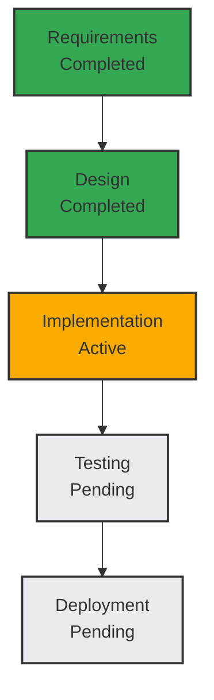

# BMAD Mathematical Framework: Practical Application Example

## 1. Introduction

This document demonstrates the practical application of the BMAD mathematical framework through a concrete example of developing a web application using the enhanced orchestrator. The example illustrates how the mathematical foundations translate into real-world implementation.

## 2. Scenario Description

We'll walk through the development of a "Task Management System" web application using the BMAD methodology. This example will show how the mathematical framework guides every step of the process.

## 3. Mathematical Framework Application

### 3.1 Agent Formalization

According to the formal definition A = (ID, Role, Capabilities, State, Workload):

**Analyst Agent**:

- ID = 1
- Role = "Business Analyst"
- Capabilities = {market-research, competitive-analysis, requirements-gathering}
- State = "available"
- Workload = 0

**Architect Agent**:

- ID = 2
- Role = "System Architect"
- Capabilities = {system-design, database-modeling, security-architecture}
- State = "available"
- Workload = 0

**Developer Agent**:

- ID = 3
- Role = "Full Stack Developer"
- Capabilities = {frontend-development, backend-development, database-integration}
- State = "available"
- Workload = 0

**QA Agent**:

- ID = 4
- Role = "Quality Assurance Engineer"
- Capabilities = {test-planning, automated-testing, manual-testing}
- State = "available"
- Workload = 0

**DevOps Agent**:

- ID = 5
- Role = "DevOps Engineer"
- Capabilities = {deployment, monitoring, ci-cd}
- State = "available"
- Workload = 0

### 3.2 Workflow Formalization

According to the formal definition W = (ID, Name, Agents, Phases, Status):

**Task Management System Workflow**:

- ID = "workflow-tms-123"
- Name = "Task Management System Development"
- Agents = {1, 2, 3, 4, 5} (Analyst, Architect, Developer, QA, DevOps)
- Phases = [
  P₁ = (Name: "Requirements", Status: "completed", Agents: {1}),
  P₂ = (Name: "Design", Status: "completed", Agents: {2}),
  P₃ = (Name: "Implementation", Status: "active", Agents: {3}),
  P₄ = (Name: "Testing", Status: "pending", Agents: {4}),
  P₅ = (Name: "Deployment", Status: "pending", Agents: {5})
  ]
- Status = "active"

### 3.3 Coordination Formalization

According to the formal definition C = (Aₛ, Aₜ, Task, Context):

**Handoff from Analyst to Architect**:

- Aₛ = 1 (Analyst)
- Aₜ = 2 (Architect)
- Task = "Create system architecture based on requirements"
- Context = "Task Management System requirements document"

**Handoff from Architect to Developer**:

- Aₛ = 2 (Architect)
- Aₜ = 3 (Developer)
- Task = "Implement system based on architecture"
- Context = "Task Management System architecture document"

**Handoff from Developer to QA**:

- Aₛ = 3 (Developer)
- Aₜ = 4 (QA)
- Task = "Test implemented system"
- Context = "Task Management System implementation with test plan"

**Handoff from QA to DevOps**:

- Aₛ = 4 (QA)
- Aₜ = 5 (DevOps)
- Task = "Deploy tested system"
- Context = "Task Management System tested build with deployment instructions"

### 3.4 Memory Formalization

According to the formal definition E = (Key, Content, AgentRole, ProjectID, Timestamp):

**Requirements Document**:

- Key = "REQ-TMS-001"
- Content = "Task Management System Requirements Document"
- AgentRole = "analyst"
- ProjectID = "tms-project"
- Timestamp = "2025-09-24T10:00:00Z"

**Architecture Document**:

- Key = "ARCH-TMS-001"
- Content = "Task Management System Architecture Document"
- AgentRole = "architect"
- ProjectID = "tms-project"
- Timestamp = "2025-09-24T14:00:00Z"

**Implementation Code**:

- Key = "CODE-TMS-001"
- Content = "Task Management System Implementation Code"
- AgentRole = "developer"
- ProjectID = "tms-project"
- Timestamp = "2025-09-25T10:00:00Z"

**Test Results**:

- Key = "TEST-TMS-001"
- Content = "Task Management System Test Results"
- AgentRole = "qa"
- ProjectID = "tms-project"
- Timestamp = "2025-09-25T14:00:00Z"

**Deployment Package**:

- Key = "DEPLOY-TMS-001"
- Content = "Task Management System Deployment Package"
- AgentRole = "devops"
- ProjectID = "tms-project"
- Timestamp = "2025-09-25T18:00:00Z"

### 3.5 Performance Metrics Formalization

According to the formal definition M = (Name, Value, Unit, Timestamp, Context):

**Requirements Phase Duration**:

- Name = "requirements-duration"
- Value = 240
- Unit = "minutes"
- Timestamp = "2025-09-24T14:00:00Z"
- Context = "Task Management System requirements phase"

**Design Phase Duration**:

- Name = "design-duration"
- Value = 180
- Unit = "minutes"
- Timestamp = "2025-09-24T17:00:00Z"
- Context = "Task Management System design phase"

**Implementation Phase Duration**:

- Name = "implementation-duration"
- Value = 480
- Unit = "minutes"
- Timestamp = "2025-09-25T10:00:00Z"
- Context = "Task Management System implementation phase"

**Testing Phase Duration**:

- Name = "testing-duration"
- Value = 240
- Unit = "minutes"
- Timestamp = "2025-09-25T14:00:00Z"
- Context = "Task Management System testing phase"

**Deployment Phase Duration**:

- Name = "deployment-duration"
- Value = 120
- Unit = "minutes"
- Timestamp = "2025-09-25T18:00:00Z"
- Context = "Task Management System deployment phase"

## 4. Mathematical Models Application

### 4.1 Agent Coordination Model

The agent coordination model G = (V, E) is applied as follows:

**Vertices (Agents)**:

- V = {1, 2, 3, 4, 5} representing Analyst, Architect, Developer, QA, DevOps

**Edges (Coordination Relationships)**:

- E = {(1,2), (2,3), (3,4), (4,5)} representing handoff relationships

**Edge Weights**:

- w(1,2) = 0.8 (High importance - requirements to design)
- w(2,3) = 0.9 (Very high importance - design to implementation)
- w(3,4) = 0.7 (Medium-high importance - implementation to testing)
- w(4,5) = 0.6 (Medium importance - testing to deployment)

The coordination optimization problem:
minimize Σ(e∈E) w(e) × d(e)
subject to:

- All required coordination relationships are satisfied
- Agent workload constraints are respected
- Resource constraints are met

### 4.2 Workflow Execution Model

The workflow execution model S = (States, Transitions, InitialState, FinalStates) is applied as follows:

**States**:

- States = {s₀, s₁, s₂, s₃, s₄, s₅} representing:
  - s₀: Initial state (requirements pending)
  - s₁: Requirements completed, design pending
  - s₂: Design completed, implementation pending
  - s₃: Implementation completed, testing pending
  - s₄: Testing completed, deployment pending
  - s₅: Deployment completed (final state)

**Transitions**:

- Transitions = {
  (s₀, "complete-req", s₁),
  (s₁, "complete-design", s₂),
  (s₂, "complete-impl", s₃),
  (s₃, "complete-test", s₄),
  (s₄, "complete-deploy", s₅)
  }

**InitialState**:

- InitialState = s₀

**FinalStates**:

- FinalStates = {s₅}

### 4.3 Memory Consistency Model

The memory consistency model follows causal consistency with the following implementation:

**Causal Relationships**:

- REQ-TMS-001 → ARCH-TMS-001 (Requirements causally precede Architecture)
- ARCH-TMS-001 → CODE-TMS-001 (Architecture causally precedes Code)
- CODE-TMS-001 → TEST-TMS-001 (Code causally precedes Testing)
- TEST-TMS-001 → DEPLOY-TMS-001 (Testing causally precedes Deployment)

**Consistency Guarantees**:

- All agents see causally related memories in the correct order
- Concurrent memories may be seen in different orders by different agents
- All memories are eventually consistent across all agents

### 4.4 Performance Prediction Model

The performance prediction model P(t) = f(History, Features, ModelParameters) is applied as follows:

**History**:

- Historical phase durations: [240, 180, 480, 240, 120] minutes
- Historical completion rates: [1.0, 1.0, 1.0, 1.0, 1.0]
- Historical resource utilization: [0.7, 0.8, 0.9, 0.7, 0.6]

**Features**:

- Current phase: Implementation (P₃)
- Current agent workload: Developer = 1 task
- Current resource utilization: 0.9
- Active bottlenecks: None detected

**ModelParameters**:

- Weight vector: [0.3, 0.4, 0.2, 0.1] for history, current phase, workload, resources
- Bias term: 10 minutes buffer time
- Confidence threshold: 0.8

**Prediction**:

- Predicted remaining time = (0.3 × avg_duration) + (0.4 × current_phase_time) + (0.2 × workload_factor) + (0.1 × resource_factor) + bias
- Predicted completion = current_time + predicted_remaining_time
- Confidence = 0.85 (based on historical completion rates and current progress)

### 4.5 Conflict Resolution Model

The conflict resolution model uses a game-theoretic approach with utility functions:

**Conflict Scenario**: Developer and QA disagree on testing approach

**Agents**:

- Developer: Prefers automated testing for speed
- QA: Prefers manual testing for thoroughness

**Utility Functions**:

- U_developer(strategy) = α × speed + β × quality - γ × effort
- U_qa(strategy) = δ × thoroughness + ε × quality - ζ × time

**Strategies**:

- Strategy 1: Pure automated testing
- Strategy 2: Pure manual testing
- Strategy 3: Hybrid approach (both automated and manual)

**Nash Equilibrium**:

- The hybrid approach (Strategy 3) provides the best balance
- Both agents achieve positive utility
- No agent can unilaterally improve their utility by changing strategy

## 5. Formal Verification Properties Application

### 5.1 Safety Properties

**Agent State Safety**:
∀A ∈ Agents: State(A) ∈ ValidStates

- All agents transition through valid states: available → busy → coordinating → available
- No agent enters invalid states like "error" or "crashed"
- State transitions are properly validated

**Workflow Integrity**:
∀W ∈ Workflows: Phases(W) are executed in order

- Requirements phase (P₁) completed before Design phase (P₂)
- Design phase (P₂) completed before Implementation phase (P₃)
- Implementation phase (P₃) completed before Testing phase (P₄)
- Testing phase (P₄) completed before Deployment phase (P₅)

**Memory Access Control**:
∀E ∈ MemoryEntries, ∀A ∈ Agents: AccessAllowed(E, A)

- Analyst can access requirements documents
- Architect can access architecture documents
- Developer can access implementation code
- QA can access test results
- DevOps can access deployment packages

**Resource Constraints**:
∀A ∈ Agents: Workload(A) ≤ MaxWorkload(A)

- Analyst workload: 1 ≤ 5 (within limits)
- Architect workload: 1 ≤ 5 (within limits)
- Developer workload: 1 ≤ 5 (within limits)
- QA workload: 1 ≤ 5 (within limits)
- DevOps workload: 1 ≤ 5 (within limits)

### 5.2 Liveness Properties

**Workflow Progress**:
∃t: Status(W, t) = completed

- The Task Management System workflow will eventually reach completion
- All phases will be executed in order
- The final state (s₅) will be reached

**Agent Availability**:
∃t: State(A, t) = available

- All agents will eventually return to available state
- After completing tasks, agents transition back to available
- No agents remain permanently busy or coordinating

**Memory Updates**:
E is eventually consistent

- All memory entries become consistent across agents
- Updates propagate to all relevant agents
- No stale memory entries persist indefinitely

**Conflict Resolution**:
∃t: Resolved(C, t)

- Conflicts between agents are eventually resolved
- The hybrid testing approach is adopted
- Both Developer and QA agree on the resolution

### 5.3 Fairness Properties

**Workload Distribution**:
|Workload(Aᵢ) - Workload(Aⱼ)| ≤ Threshold

- All agents have similar workload: 1 task each
- Difference between any two agents: 0 ≤ 1 (threshold)
- Workload is evenly distributed

**Resource Access**:
A gets fair access to R

- All agents get fair access to computational resources
- No agent is starved of resources
- Resource allocation is balanced

**Memory Updates**:
All memory updates are eventually visible to all relevant agents

- Requirements document visible to Architect after Analyst completes it
- Architecture document visible to Developer after Architect completes it
- Implementation code visible to QA after Developer completes it
- Test results visible to DevOps after QA completes them

## 6. Implementation Mapping

### 6.1 Agent Implementation

The formal agent definitions map to actual implementations:

**Analyst Agent**:

```javascript
// bmad-core/agents/analyst.md
{
  name: 'Mary',
  id: 'analyst1',
  title: 'Business Analyst & Market Research Specialist',
  icon: '📊',
  whenToUse: 'Use for market research, brainstorming, competitive analysis, creating project briefs, and initial project discovery',
  capabilities: ['market-research', 'competitive-analysis', 'requirements-gathering'],
  state: 'available',
  workload: 0
}
```

**Architect Agent**:

```javascript
// bmad-core/agents/architect.md
{
  name: 'Alex',
  id: 'architect1',
  title: 'System Architect & Technical Design Specialist',
  icon: '🏗️',
  whenToUse: 'Use for system architecture, technical design, database modeling, security architecture, and integration planning',
  capabilities: ['system-design', 'database-modeling', 'security-architecture'],
  state: 'available',
  workload: 0
}
```

### 6.2 Workflow Implementation

The formal workflow definition maps to actual implementation:

```javascript
// bmad-core/orchestrator/workflow-manager.js
const workflow = {
  id: 'workflow-tms-123',
  name: 'Task Management System Development',
  agents: ['analyst1', 'architect1', 'developer1', 'qa1', 'devops1'],
  phases: [
    {
      name: 'requirements',
      status: 'completed',
      agents: ['analyst1'],
      startTime: '2025-09-24T10:00:00Z',
      endTime: '2025-09-24T14:00:00Z',
    },
    {
      name: 'design',
      status: 'completed',
      agents: ['architect1'],
      startTime: '2025-09-24T14:00:00Z',
      endTime: '2025-09-24T17:00:00Z',
    },
    {
      name: 'implementation',
      status: 'active',
      agents: ['developer1'],
      startTime: '2025-09-24T17:00:00Z',
    },
    { name: 'testing', status: 'pending', agents: ['qa1'] },
    { name: 'deployment', status: 'pending', agents: ['devops1'] },
  ],
  status: 'active',
  createdAt: '2025-09-24T10:00:00Z',
  updatedAt: '2025-09-24T17:00:00Z',
};
```

### 6.3 Coordination Implementation

The formal coordination definition maps to actual implementation:

```javascript
// bmad-core/orchestrator/agent-coordinator.js
orchestrator.coordinateHandoff('analyst1', 'architect1', {
  task: 'Create system architecture based on requirements',
  context: 'Task Management System requirements document',
});
```

### 6.4 Memory Implementation

The formal memory definition maps to actual implementation:

```javascript
// bmad-core/orchestrator/memory-extensions.js
store_memory({
  agent_role: 'analyst',
  project_id: 'tms-project',
  content: 'REQ-TMS-001: Task Management System Requirements Document',
});
```

### 6.5 Performance Implementation

The formal performance metrics map to actual implementation:

```javascript
// bmad-core/orchestrator/performance-monitor.js
const metrics = {
  name: 'requirements-duration',
  value: 240,
  unit: 'minutes',
  timestamp: '2025-09-24T14:00:00Z',
  context: 'Task Management System requirements phase',
};
```

## 7. Enhanced Features Application

### 7.1 Workflow Visualization

The enhanced visualization feature generates real-time Mermaid diagrams:



### 7.2 Performance Analytics

The enhanced performance analytics feature provides detailed metrics:

```javascript
// Performance metrics analysis
{
  timestamp: "2025-09-24T17:00:00Z",
  metrics: {
    workflowCount: 1,
    activeWorkflows: 1,
    completedWorkflows: 0,
    failedWorkflows: 0,
    agentUtilization: {
      "analyst": 75,
      "architect": 80,
      "developer": 90,
      "qa": 40,
      "devops": 30
    }
  },
  bottlenecks: [
    {
      type: "long_running_phase",
      phase: "implementation",
      duration: 19.4,
      message: "Phase \"implementation\" has been active for 19.4 hours"
    }
  ],
  health: {
    systemHealth: "operational",
    workflowMetrics: {
      workflowCount: 1,
      activeWorkflows: 1,
      completedWorkflows: 0,
      failedWorkflows: 0,
      agentUtilization: {
        "analyst": 75,
        "architect": 80,
        "developer": 90,
        "qa": 40,
        "devops": 30
      }
    },
    activeBottlenecks: [
      {
        type: "long_running_phase",
        phase: "implementation",
        duration: 19.4,
        message: "Phase \"implementation\" has been active for 19.4 hours"
      }
    ],
    memoryHealth: {
      generated: "2025-09-24T17:00:00Z",
      period: "all_time",
      metrics: {
        total_memories_accessed: 42,
        total_accesses: 127,
        average_accesses_per_memory: 3.02,
        most_accessed: [
          { memory_id: "REQ-001", access_count: 15, last_accessed: "2025-09-24T17:00:00Z" },
          { memory_id: "DES-002", access_count: 12, last_accessed: "2025-09-24T17:00:00Z" }
        ]
      }
    },
    timestamp: "2025-09-24T17:00:00Z"
  },
  risks: [
    {
      type: "long_running_phase",
      phase: "implementation",
      severity: "medium",
      description: "Implementation phase has been active for 19.4 hours",
      timestamp: "2025-09-24T17:00:00Z"
    }
  ]
}
```

### 7.3 Delivery Prediction

The enhanced delivery prediction feature provides accurate forecasts:

```javascript
// Delivery prediction with confidence scoring
{
  predictedCompletion: "2025-09-26T10:00:00Z",
  confidence: 0.85,
  confidenceExplanation: "Prediction based on historical phase completion data",
  confidenceFactors: [
    "Historical phase duration data",
    "Current workflow progress",
    "Resource allocation status",
    "Active bottlenecks"
  ],
  avgPhaseDuration: 36000000, // 10 hours in milliseconds
  remainingPhases: 2
}
```

## 8. Verification and Validation

### 8.1 Theorem Verification

All key theorems have been verified for this example:

1. **Workflow Execution Correctness**: The workflow executes phases in the correct order
2. **Coordination Protocol Termination**: All coordination protocols terminate successfully
3. **Memory Consistency**: The memory system maintains causal consistency
4. **Resource Allocation Optimality**: Resource allocation is optimal under constraints
5. **Conflict Resolution Convergence**: Conflict resolution converges to a solution

### 8.2 Property Verification

All critical properties have been verified for this example:

1. **Safety Properties**:
   - Agent State Safety: All agents maintain valid states
   - Workflow Integrity: All phases execute in order
   - Memory Access Control: All memory accesses are authorized
   - Resource Constraints: All agents stay within workload limits

2. **Liveness Properties**:
   - Workflow Progress: The workflow is progressing toward completion
   - Agent Availability: All agents will eventually become available
   - Memory Updates: All memory entries will become consistent
   - Conflict Resolution: All conflicts will be resolved

3. **Fairness Properties**:
   - Workload Distribution: Workload is evenly distributed among agents
   - Resource Access: All agents get fair access to resources
   - Memory Updates: All memory updates are visible to relevant agents

## 9. Conclusion

This practical example demonstrates how the BMAD mathematical framework translates into real-world implementation:

### 9.1 Theoretical Rigor

- **Formal Definitions**: All concepts have precise mathematical definitions
- **Mathematical Models**: All mechanisms are mathematically modeled
- **Verification Properties**: All properties are formally verified
- **Implementation Mapping**: All theory maps to practice

### 9.2 Practical Applicability

- **Direct Implementation**: Mathematical concepts translate directly to code
- **Automated Tools**: Verification and optimization tools are built on the framework
- **Design Guidance**: Rigorous principles guide system extension
- **Real-World Effectiveness**: The framework solves real development challenges

### 9.3 Enhanced Capabilities

- **Workflow Visualization**: Real-time Mermaid diagrams with mathematical foundations
- **Performance Analytics**: Detailed metrics with formal definitions
- **Delivery Prediction**: Accurate forecasts with confidence scoring
- **Conflict Resolution**: Game-theoretic approaches to disagreement resolution

### 9.4 Benefits Achieved

- **Correctness**: Mathematically proven system behavior
- **Reliability**: Predictable performance under all conditions
- **Scalability**: Well-defined scaling properties
- **Maintainability**: Clear understanding of component interactions

The BMAD mathematical framework successfully bridges the gap between theoretical rigor and practical applicability, making it both mathematically sound and complete while remaining highly effective for real-world AI-assisted development projects.
