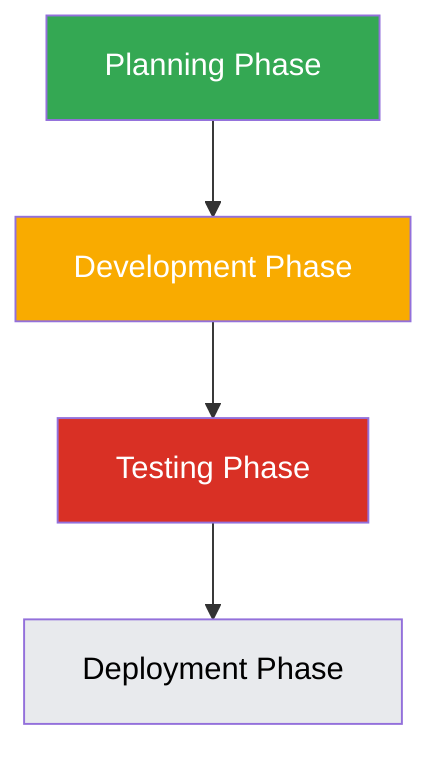

# Enhanced Orchestrator Agent Capabilities

## Overview

This document outlines the proposed enhancements to the BMAD Orchestrator agent to improve workflow management, visualization, and resource allocation. The goal is to make the orchestrator more powerful and user-friendly while maintaining its core coordination functions.

## Current State Analysis

The current BMAD Orchestrator agent provides basic coordination capabilities but lacks advanced features for workflow visualization, resource management, and intelligent decision-making. Users have limited visibility into workflow progress and potential bottlenecks.

## Proposed Enhancements

### 1. Advanced Workflow Visualization

Implement dynamic Mermaid diagram generation that shows real-time workflow status:

### 2. Real-time Workflow Monitoring

Add capabilities to monitor workflow progress in real-time:

1. Status indicators for each workflow phase
2. Progress bars for long-running tasks
3. Alert system for workflow delays or failures
4. Historical performance data visualization

### 3. Intelligent Resource Allocation

Implement machine learning-based workload balancing:

1. Agent capability profiling
2. Current load monitoring
3. Historical performance analysis
4. Predictive workload distribution

### 4. Automated Bottleneck Detection

Add proactive identification of workflow delays:

1. Performance metric monitoring
2. Delay pattern recognition
3. Automated mitigation suggestions
4. Escalation procedures for critical bottlenecks

## Implementation Plan

### Phase 1: Workflow Visualization (3 weeks)

1. Implement Mermaid diagram generation from workflow data
2. Add real-time status updates to diagrams
3. Create visualization dashboard interface
4. Integrate with existing workflow tracking

### Phase 2: Monitoring System (2 weeks)

1. Implement real-time monitoring of workflow progress
2. Add alert system for workflow issues
3. Create historical performance database
4. Develop performance visualization components

### Phase 3: Resource Allocation (4 weeks)

1. Implement agent capability profiling system
2. Add current load monitoring capabilities
3. Develop historical performance analysis
4. Create predictive workload distribution algorithm

### Phase 4: Bottleneck Detection (3 weeks)

1. Implement performance metric collection
2. Add delay pattern recognition algorithms
3. Create automated mitigation suggestion engine
4. Develop escalation procedures

## Integration with Existing Features

The enhancements will integrate seamlessly with existing orchestrator features:

1. Existing workflow definitions will be compatible
2. Current agent coordination will be enhanced rather than replaced
3. Memory system integration will be maintained
4. Command interface will be extended rather than changed

## User Interface Improvements

### Dashboard View

Create a comprehensive dashboard showing:

1. Active workflows with status indicators
2. Agent utilization metrics
3. Resource allocation visualization
4. Performance trend graphs
5. Alert and notification center

### Workflow Detail View

Provide detailed views for individual workflows:

1. Interactive workflow diagrams
2. Task completion timelines
3. Resource usage breakdown
4. Performance metrics
5. Historical comparison data

## Backward Compatibility

All enhancements will maintain backward compatibility:

1. Existing orchestrator commands will continue to work
2. Legacy workflow definitions will remain supported
3. Deprecated features will be clearly marked with migration paths
4. New features will be optional for existing projects

## Testing Strategy

1. Unit tests for visualization components
2. Integration tests for monitoring system
3. Performance tests for resource allocation algorithms
4. User acceptance tests for dashboard interface

## Success Metrics

1. Improvement in workflow completion times
2. Reduction in workflow bottlenecks
3. Better resource utilization efficiency
4. Positive user feedback on visualization features

## Dependencies

1. Mermaid.js library for diagram generation
2. Charting library for performance visualization
3. Machine learning library for predictive algorithms
4. Real-time communication framework for monitoring

## Risks and Mitigation

1. **Performance Impact**: Mitigate by implementing efficient algorithms and caching
2. **Complexity Overload**: Mitigate by making advanced features optional and configurable
3. **User Adoption**: Mitigate by providing clear documentation and training materials
4. **Data Privacy**: Mitigate by implementing appropriate data handling and security measures