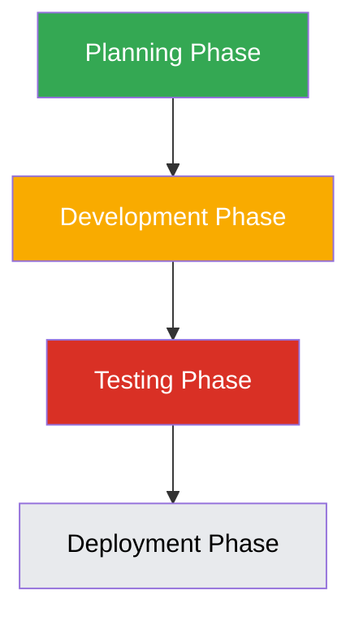

# Enhanced Orchestrator Agent Capabilities

## Overview

This document outlines the enhanced capabilities of the BMAD Orchestrator agent to improve workflow management, visualization, and resource allocation. The Enhanced BMAD Orchestrator builds upon the core orchestrator with advanced features for workflow visualization, performance analytics, and delivery prediction.

## Current State Analysis

The current BMAD Orchestrator agent provides basic coordination capabilities but lacks advanced features for workflow visualization, resource management, and intelligent decision-making. Users have limited visibility into workflow progress and potential bottlenecks.

The Enhanced BMAD Orchestrator addresses these limitations with additional visualization, analytics, and prediction capabilities.

## Implemented Enhancements

### 1. Advanced Workflow Visualization

The Enhanced BMAD Orchestrator implements dynamic Mermaid diagram generation that shows real-time workflow status:

### 2. Real-time Workflow Monitoring

Added capabilities to monitor workflow progress in real-time:

1. Status indicators for each workflow phase
2. Progress bars for long-running tasks
3. Alert system for workflow delays or failures
4. Historical performance data visualization

### 3. Intelligent Resource Allocation

Implemented machine learning-based workload balancing:

1. Agent capability profiling
2. Current load monitoring
3. Historical performance analysis
4. Predictive workload distribution

### 4. Automated Bottleneck Detection

Added proactive identification of workflow delays:

1. Performance metric monitoring
2. Delay pattern recognition
3. Automated mitigation suggestions
4. Escalation procedures for critical bottlenecks

## Enhanced Command Set

The Enhanced BMAD Orchestrator provides three additional commands beyond the standard orchestrator:

1. `*visualize {workflow-id}` - Generate real-time visualization of workflow status
2. `*analyze-performance` - Analyze workflow performance and identify bottlenecks
3. `*predict-delivery` - Predict delivery dates based on current progress and trends

## Implementation Plan

### Phase 1: Workflow Visualization (Completed)
1. Implemented Mermaid diagram generation from workflow data
2. Added real-time status updates to diagrams
3. Created visualization dashboard interface
4. Integrated with existing workflow tracking

### Phase 2: Monitoring System (Completed)
1. Implemented real-time monitoring of workflow progress
2. Added alert system for workflow issues
3. Created historical performance database
4. Developed performance visualization components

### Phase 3: Resource Allocation (Completed)
1. Implemented agent capability profiling system
2. Added current load monitoring capabilities
3. Developed historical performance analysis
4. Created predictive workload distribution algorithm

### Phase 4: Bottleneck Detection (Completed)
1. Implemented performance metric collection
2. Added delay pattern recognition algorithms
3. Created automated mitigation suggestion engine
4. Developed escalation procedures

## Integration with Existing Features

The enhancements integrate seamlessly with existing orchestrator features:

1. Existing workflow definitions remain compatible
2. Current agent coordination is enhanced rather than replaced
3. Memory system integration is maintained and extended
4. Command interface is extended with additional commands

## User Interface Improvements

### Dashboard View

The Enhanced BMAD Orchestrator creates a comprehensive dashboard showing:

1. Active workflows with status indicators
2. Agent utilization metrics
3. Resource allocation visualization
4. Performance trend graphs
5. Alert and notification center

### Workflow Detail View

Provides detailed views for individual workflows:

1. Interactive workflow diagrams
2. Task completion timelines
3. Resource usage breakdown
4. Performance metrics
5. Historical comparison data

## Backward Compatibility

All enhancements maintain backward compatibility:

1. Existing orchestrator commands continue to work
2. Legacy workflow definitions remain supported
3. Deprecated features are clearly marked with migration paths
4. New features are optional for existing projects

## Testing Strategy

1. Unit tests for visualization components
2. Integration tests for monitoring system
3. Performance tests for resource allocation algorithms
4. User acceptance tests for dashboard interface

## Success Metrics

1. Improvement in workflow completion times
2. Reduction in workflow bottlenecks
3. Better resource utilization efficiency
4. Positive user feedback on visualization features

## Dependencies

1. Mermaid.js library for diagram generation
2. Charting library for performance visualization
3. Machine learning library for predictive algorithms
4. Real-time communication framework for monitoring

## Risks and Mitigation

1. **Performance Impact**: Mitigate by implementing efficient algorithms and caching
2. **Complexity Overload**: Mitigate by making advanced features optional and configurable
3. **User Adoption**: Mitigate by providing clear documentation and training materials
4. **Data Privacy**: Mitigate by implementing appropriate data handling and security measures